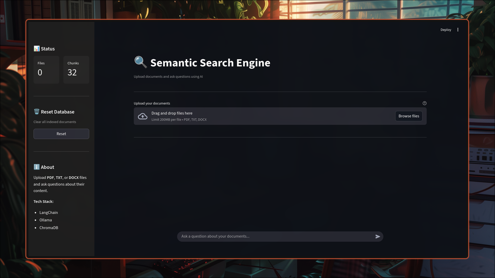

<div align="center">

# Semantic Search Engine


<br><br>



<br>

*I developed this Semantic Search Engine to validate local RAG architectures, I wanted a privacy first system that runs entirely on local hardware, avoiding cloud dependencies and latency.*

</div>

## Table of Contents

1. [Overview](#overview)
2. [Core Architecture](#core-architecture)
3. [Project Structure](#project-structure)
4. [How It Works](#how-it-works)
5. [Nuances](#nuances)
6. [Prerequisites](#prerequisites)
7. [Installation](#installation)
8. [Usage](#usage)
9. [Troubleshooting](#troubleshooting)
10. [Tech Stack](#tech-stack)

## Overview

I started this project with a clear goal, to build a robust document retrieval system that runs locally. I needed to query my personal archives without exposing data to external APIs. This application represents the culmination of that effort, a streamlined RAG system that uses semantic understanding to find relevant info.

I prioritized a modular design. The backend logic resides in `src/rag_engine.py`, it handles document processing and vector retrieval. I built the frontend with Streamlit in `src/app.py` to provide a clean and responsive interface.

## Core Architecture

I designed the architecture to be simple yet effective, focusing on modularity and local execution. The system is split into two main logical components, the RAG engine and the UI layer.

## Project Structure

I organized the codebase to separate concerns, keeping the core logic distinct from the UI and tests.

```text
.
├── assets/                  # Static assets like images
├── chromadb/                # Persisted vector store data
├── src/
│   ├── app.py               # Main Streamlit application entry point
│   ├── rag_engine.py        # Core RAG logic (Ingestion, Retrieval)
│   └── ui/
│       ├── components.py    # Reusable UI widgets
│       └── styles.py        # Custom CSS styling
├── tests/                   # Unit and integration tests
├── .gitignore               # Git configuration
├── pyproject.toml           # Project configuration
├── README.md                # Documentation
├── requirements.txt         # Dependency usage
└── uv.lock                  # Lockfile for reproducible builds
```

## How It Works

I implemented a specific pipeline to ensure high quality retrieval.

### 1. Ingestion & Cleaning
When you upload a file, I first validate the format. I then use a custom cleaning heuristic in `_clean_text`, which calculates the ratio of single characters to words. If this ratio exceeds 0.4, I assume the text is noisy (like OCR artifacts) and apply aggressive cleaning.

### 2. Chunking strategy
I utilize `RecursiveCharacterTextSplitter` with a chunk size of **500 characters** and an overlap of **75 characters**. I found this size optimal for preserving context while keeping chunks focused enough for accurate vector similarity matching.

### 3. Vector Storage
Each chunk is embedded using `mxbai-embed-large` and stored in Chroma. I persist this data to `./chroma/db`, ensuring that your knowledge base survives application restarts.

### 4. Retrieval & Generation
When you ask a question, I embed it and retrieve the top **4** most similar chunks (`k=4`). These chunks are passed to `gemma3:4b` via a strict system prompt that forces the model to use *only* the provided context, reducing hallucinations.

## Nuances

I built this system with several specific design choices in mind.

*   **Privacy First**, Everything runs locally. No data leaves your machine, making it safe for sensitive personal documents.
*   **Session State**, I use Streamlit's session state to manage the `RAGEngine` instance, ensuring that the heavy model initialization happens only once per session, not on every interaction.
*   **Error Handling**, I implemented robust error catching during file processing. If a single file fails to process (e.g. a corrupted PDF), the system logs the error and continues processing the rest of the batch, preventing a total crash.

## Prerequisites

Before setting up the project, ensure you have these tools installed.

> [!NOTE]
> Ensure you have Docker or straightforward access to install new packages, as `uv` and `ollama` are critical dependencies.

* **Python 3.13+**, The core runtime.
* **Ollama**, The local LLM runner.
* **uv**, My recommended package manager, though pip works too.

## Installation

### 1. Clone the Repository

Start by getting the code.

```bash
git clone https://github.com/FamilOrujov/semantic-search-engine-langchain.git
cd semantic-search-engine-langchain
```

### 2. Install Dependencies

I recommend `uv` for speed.

```bash
uv sync
```

Or use pip.

```bash
pip install -r requirements.txt
```

### 3. Setup Models

I rely on specific Ollama models, pull them before running the app.

> [!IMPORTANT]
> The application will fail to start if these models are not available locally.

```bash
ollama pull mxbai-embed-large
ollama pull gemma3:4b
```

## Usage

### Launch the Application

Run the Streamlit interface.

```bash
uv run streamlit run src/app.py
```

### Ingest Documents

I implemented a drag and drop interface. Upload PDFs, TXTs, or DOCXs. The system automatically cleans the text, chunks it, and builds the vector index.

### Querying

Type your question in the chat bar. I designed the system to retrieve the top 4 relevant chunks and synthesize an answer using the Gemma model.

## Troubleshooting

> [!WARNING]
> If you encounter database corruption, use the reset functionality immediately to prevent partial writes.

* **Connection Errors**, If the app fails to connect, checking if Ollama is running is the first step `ollama serve`.
* **Missing Models**, If you see error messages about models, run the pull commands again.
* **Database Reset**, I added a reset button in the UI, use it if the vector store state seems corrupted.

## Tech Stack

I carefully selected these components to ensure reliability and performance.

| Component | Technology | Rationale |
| :--- | :--- | :--- |
| **LLM Inference** | Ollama | Enables local execution of `gemma3:4b` and `mxbai-embed-large` without API keys. |
| **Orchestration** | LangChain | Standardizes the interface for document loading, splitting, and retrieval chains. |
| **Vector Store** | Chroma | A lightweight, persistent vector database that requires no external server setup. |
| **Frontend** | Streamlit | Allows for rapid development of a reactive web interface with built-in state management. |
| **PDF Processing** | PDFPlumber | Provides accurate text extraction from PDF documents. |
| **Doc Processing** | docx2txt | Handles text extraction from Word documents. |
